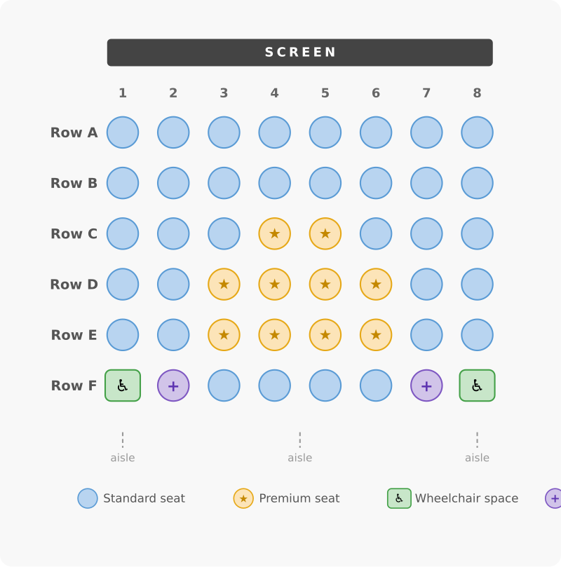

# UX Design Document: Cinema Seat Reservation

## Context and purpose

You will write a UX design document for a seat reservation system in a small single-screen cinema ("Kino Stella"). The document must be precise enough that an experienced frontend developer or an AI coding agent can implement the entire frontend without asking you a single question.

This exercise trains you to think through interaction logic before writing code. You are not designing how things look. You are designing how things work.

## Deliverable

A single UX design document covering the seat selection and checkout flow for Kino Stella. No code. No visual design.

## What your document covers and what it does not

**In scope:**

- Seat selection (interactive seating plan)
- Shopping cart (synchronized with seat selection)
- Checkout (confirm reservation)
- Conflict handling (two users selecting the same seat at nearly the same time)
- Where to display the currently selected film, date, and showtime (already chosen before this screen)

**Out of scope:**

- Film browsing, date/time selection (already happened)
- Payment processing (happens after checkout)
- User accounts or authentication
- Admin views

## Focus: interaction logic, not visual design or implementation

Your document describes UI/UX logic: what screens exist, what elements are on each screen, what states those elements can be in, what happens when the user interacts with them, and what happens on errors or edge cases.

- Name visual states (e.g., "available", "selected", "reserved-by-others", "wheelchair-companion-locked"). Do not specify colors, fonts, sizes, or pixel values.
- Describe screen layout in terms of regions and their relationships (e.g., "seating plan on the left, shopping cart on the right"). Do not create Figma mockups or detailed wireframes.
- Describe what the user sees and does, not how the system implements it. Write "seats reserved by others update in real time" instead of "the server pushes updates via WebSocket." Technology choices (polling, WebSockets, HTTP) are implementation decisions that come later.
- Visual design (colors, typography, CSS) is a separate step that comes later.

## The cinema: Kino Stella



**Seat types and pricing** (fixed, not dependent on film or showtime):

| Seat type                      |     Price |
| ------------------------------ | --------: |
| Regular                        |  8.50 EUR |
| Premium                        | 12.00 EUR |
| Wheelchair                     |  8.50 EUR |
| Companion (next to wheelchair) |  8.50 EUR |

- The cinema has a single screen, with two aisles running from front to back, dividing the seats into three sections.
- Some seats are premium seats (more expensive, better position).
- Three wheelchair-accessible seats:
  - Two are side-by-side.
  - The third has a companion seat next to it. The companion seat can only be selected if the same user also selects the wheelchair seat next to it. A user who selects the wheelchair seat is not required to also select the companion seat.
- Maximum group size: 6 people.

## Core requirements

Your UX design document must cover all of the following:

### Seating plan interaction

- Interactive seating plan showing all seats with their current state
- Every seat has a type (regular, premium, wheelchair, companion) and a state. These are two separate dimensions: a wheelchair seat can be available, selected, or reserved, just like a regular seat. Seat states your document must define: available, selected (by current user), reserved (by another user), companion-locked (companion seat whose adjacent wheelchair seat is not selected by the current user), and any others you identify
- Clicking/tapping a seat selects or deselects it
- The companion seat rule: describe exactly what happens when a user tries to select the companion seat without selecting the wheelchair seat, and what happens when a user deselects the wheelchair seat while the companion seat is still selected
- Group size limit of 6: what happens when the user tries to select a 7th seat?

### Booking modes

Two modes the user can switch between:

- **Row mode:** Select a number of seats and a preferred row. The system finds consecutive seats without gaps. Remember that aisles divide each row into three sections. Define what "consecutive without gaps" means in relation to aisles. Describe what happens if no consecutive block is available. The wheelchair row has a different layout from regular rows (fewer seats, companion seat logic). State whether row mode includes or excludes the wheelchair row, and why.
- **Pick mode:** Select each seat individually by clicking on the seating plan. Wheelchair seats, including companion seats, are always selectable in pick mode (subject to the companion seat rule).

Describe how switching between modes works. What happens to already-selected seats?

### Shopping cart

- Always visible alongside the seating plan
- Shows selected seats with their type and individual price
- Shows total price
- Updates in real time as seats are selected/deselected
- Describe what information is shown per seat (row, seat number, type, price?)

### Checkout

- Describe the checkout flow after seat selection is complete
- What information is shown on the checkout/confirmation screen?
- What is the final action the user takes?

### Conflict handling

Multiple users see the seating plan at the same time. Seats reserved by others update in real time. Two conflict scenarios can occur:

**During selection:** A seat the user has already selected gets reserved by another user before the current user goes to checkout.

- What happens to the user's selection of that seat?
- How is the user notified?
- What happens to the shopping cart?

**At checkout:** The user tries to confirm a reservation, but one or more selected seats were reserved by someone else in the meantime.

- What message does the user see?
- What is the recovery flow? (Back to seat selection? Automatic suggestion of alternatives?)

## Advanced requirements

Pick one or more of these to extend your document:

- **Rebate codes:** The user can enter a rebate code before checkout. Describe the interaction: where is the input field, when is the code validated, how are discounts shown in the cart, what happens on invalid codes?
- **Responsive design:** Describe how the seating plan and cart adapt to mobile screens. What changes in layout, interaction, or information density?
- **Real-time sync visualization:** When another user selects or reserves a seat, how does it animate or transition on your screen? Describe the visual feedback.
- **Love seats:** Double-wide premium seats for couples (two seats that must be booked together). Describe selection behavior and cart display.

## Document template

Use this section outline for your UX design document. Copy it and fill in every section. You may add subsections, but do not remove any.

```
# UX Design Document: Kino Stella Seat Reservation

## Screen overview
<!-- Name the screen(s), describe their purpose, and state where film/date/showtime info appears. -->

## Screen layout
<!-- Describe the layout in terms of regions and their spatial relationships.
     Do not specify colors, fonts, or pixel values. -->

## Seat types and states
<!-- Seat types (regular, premium, wheelchair, companion) and seat states are two
     separate dimensions. List every state a seat can be in. For each state, describe:
     - what the user sees (in terms of visual distinction, not specific colors)
     - what triggers the transition into this state
     - what transitions are possible out of this state
     Note which states are specific to certain seat types (e.g., companion-locked). -->

## Seating plan interaction
<!-- Describe what happens when the user clicks/taps a seat in each state.
     Cover the companion seat rule and the group size limit. -->

## Booking modes
<!-- Describe row mode and pick mode separately.
     For row mode, define how aisles affect consecutive seat selection
     and state whether the wheelchair row is included or excluded.
     State what happens when the user switches between modes. -->

## Shopping cart
<!-- State what information is shown per seat, how the total is calculated,
     and how the cart updates when seats change. -->

## Checkout flow
<!-- Describe the steps from "seats selected" to "reservation confirmed."
     State what information the confirmation screen shows. -->

## Conflict handling
<!-- Cover both conflict scenarios:
     1. During selection: a seat the user already selected gets reserved by someone else.
     2. At checkout: selected seats are no longer available when the user confirms.
     For each: what the user sees, what happens to their selection, and how they continue. -->

## Advanced: [your chosen extension]
<!-- Only if you chose an advanced requirement. -->
```

## Worked example: calibrating depth and precision

The example below shows the level of detail expected for one small part of the document. It uses a tooltip interaction, which is not part of your core task. Read it to calibrate your own writing, not to copy.

> **Seat tooltip**
>
> When the user hovers over a seat (desktop) or long-presses a seat (mobile), a tooltip appears next to the seat showing: row letter, seat number, seat type, and price. The tooltip disappears when the cursor leaves the seat or when the user lifts their finger.
>
> If the seat is in the "reserved" state, the tooltip shows only "Reserved" and omits price and seat type.
>
> If another tooltip is already visible, it closes before the new one opens. Only one tooltip is visible at a time.

This example shows three things: (1) every user action has a defined outcome, (2) different states lead to different behavior, (3) edge cases (mobile, already-open tooltip) are handled explicitly. Your document sections must reach this level of precision.

## Self-check before submission

Go through these questions before you hand in your document. Every answer should be "yes."

- Does your document clearly separate seat types from seat states, and describe what triggers each transition between states?
- Can a developer implement the companion seat rule from your description alone, without guessing what should happen in any case?
- Does your conflict handling cover both scenarios: a seat lost during selection and seats lost at checkout? For each, is it clear what the user sees, what happens to their selection, and how they continue?
- Did you describe both booking modes, including what happens to already-selected seats when the user switches modes?
- Did you specify where the film, date, and showtime information appears on the screen?
- Does the shopping cart section state exactly what information is shown per seat and how the total is calculated?
- If you removed all mention of colors, fonts, and sizes from your document, would it still be complete? (It should be. If not, you mixed in visual design.)
- Does your document describe only what the user sees and does, without specifying technologies, protocols, or implementation mechanisms?
